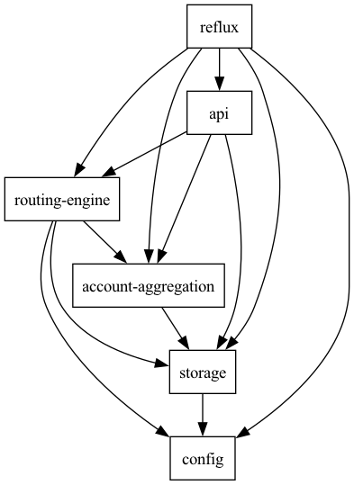

## reflux

Backend of solver which helps in seamless cross-chain asset consolidation. It aggregates user balances, automates
routing, and suggests optimal transactions.

#### Installation

To setup the project locally

```bash
# cp ./config.yaml.example ./config.yaml
cargo build
cargo run
```

#### Usage

Once build is copleted, just run the server and test with the endpoints

### Dependencies graph


